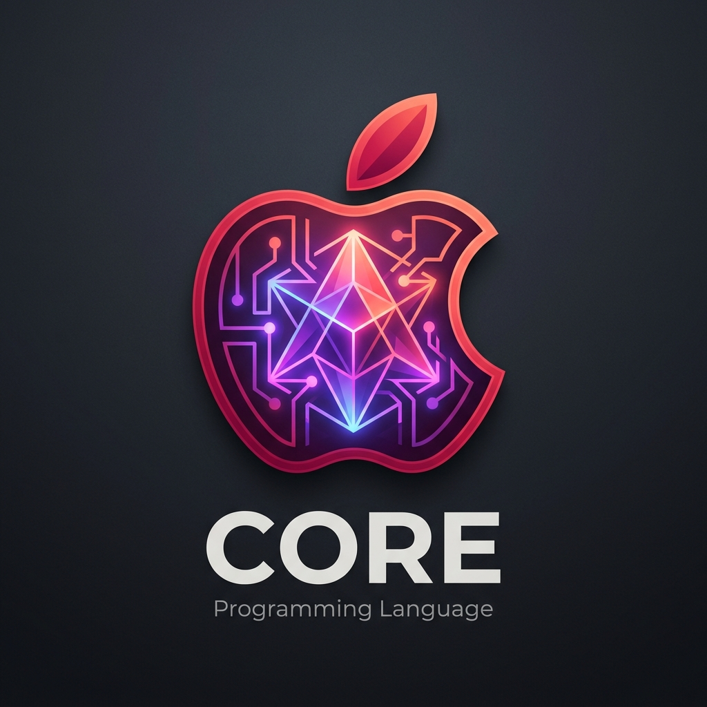

# Bahasa Pemrograman Core (.cr)

<p align="center">
  
</p>

**Core** adalah bahasa pemrograman edukatif berbahasa Indonesia yang dirancang khusus untuk membantu pemula dan pelajar di Indonesia memahami logika algoritma tanpa hambatan bahasa Inggris dan simbol sintaks yang rumit.

---

## Fitur Utama

- **Tanpa Simbol Rumit**: Tidak menggunakan kurung kurawal `{ }`, tanda kurung `( )`, atau titik koma `;`.
- **Berbasis Indentasi**: Struktur blok kode ditentukan oleh spasi indentasi (seperti Python).
- **Kata Kunci Berbahasa Indonesia**: Seluruh instruksi inti menggunakan istilah Bahasa Indonesia yang mudah dipahami.
- **Pesan Kesalahan Edukatif**: Error leksikal, sintaksis, dan waktu eksekusi dilaporkan secara jelas dalam Bahasa Indonesia beserta nomor barisnya.
- **Interpreter Ringan & Cepat**: Dibangun menggunakan Python murni tanpa dependensi eksternal.

---

## Kata Kunci (Keywords) & Sintaks

| Kata Kunci | Padanan Bahasa Inggris | Keterangan |
| :--- | :--- | :--- |
| `variabel` | `let` / `var` | Mendeklarasikan variabel baru |
| `masukan` | `input()` | Membaca input interaktif dari pengguna/keyboard |
| `cetak` | `print` | Menampilkan nilai ke layar |
| `jika` | `if` | Memulai blok percabangan kondisi |
| `lainjika` | `elif` / `else if` | Cabang kondisi lanjutan |
| `selainitu` | `else` | Cabang kondisi akhir |
| `selama` | `while` | Memulai perulangan while |
| `untuk ... dari ... hingga` | `for i in range()` | Perulangan rentang nilai otomatis |
| `fungsi` | `def` / `function` | Mendefinisikan fungsi baru |
| `kembalikan` | `return` | Mengembalikan nilai dari fungsi |
| `panggil` | `call` | Memanggil fungsi dalam ekspresi |
| `dan`, `atau`, `bukan` | `and`, `or`, `not` | Operator logika |
| `benar`, `salah`, `kosong` | `True`, `False`, `None` | Nilai boolean dan kosong |
| `acak min max` | `random.randint()` | Fungsi bawaan angka acak |
| `panjang teks` | `len()` | Fungsi bawaan panjang teks |
| `angka teks` | `int()` / `float()` | Konversi teks ke angka |

---

## Contoh Program Core

### 1. Game Tebak Angka Interaktif (`masukan`, `untuk`, `acak`)
```python
variabel angka_rahasia = panggil acak 1 10

untuk putaran dari 1 hingga 3
    variabel tebakan = masukan "Masukkan tebakan (1-10): "
    jika tebakan == angka_rahasia
        cetak "Tebakanmu Benar! Selamat!"
    selainitu
        cetak "Coba lagi ya!"
```

### 2. Variabel dan Cetak
```python
variabel nama = "Budi"
variabel umur = 17

cetak "Halo nama saya", nama
cetak "Umur saya", umur, "tahun"
```

### 3. Percabangan Kondisi (`jika` - `selainitu`)
```python
jika umur >= 17
    cetak nama, "sudah memiliki KTP"
selainitu
    cetak nama, "belum cukup umur"
```

### 3. Perulangan (`selama`)
```python
variabel hitungan = 5
selama hitungan > 0
    cetak "Hitungan:", hitungan
    hitungan = hitungan - 1
cetak "Selesai!"
```

### 4. Definisi Fungsi
```python
fungsi tambah a b
    variabel total = a + b
    kembalikan total

variabel hasil = panggil tambah 25 75
cetak "Hasil 25 + 75 =", hasil
```

---

## Cara Menjalankan

### 1. Menjalankan File `.cr`
```bash
python main.py examples/halo.cr
python main.py examples/faktorial.cr
python main.py examples/logika.cr
```

### 2. Mode Interaktif (REPL)
Jalankan tanpa argumen untuk masuk ke prompt interaktif:
```bash
python main.py
```
```text
Core > variabel x = 10
Core > variabel y = 20
Core > cetak "Jumlah:", x + y
Jumlah: 30
Core > keluar
```

### 3. Menjalankan Unit Test
```bash
python tests/test_core.py
```

---

## Struktur Proyek

```
New leanguange/
├── src/
│   ├── __init__.py
│   ├── tokens.py        # Definisi Token & TokenType
│   ├── lexer.py         # Tokenizer dengan pelacak Indentasi
│   ├── ast_nodes.py     # Struktur pohon AST
│   ├── parser.py        # Recursive descent parser
│   └── interpreter.py   # Tree-walk interpreter & environment scope
├── examples/
│   ├── halo.cr          # Contoh sintaks lengkap
│   ├── faktorial.cr     # Contoh rekursi & perhitungan
│   └── logika.cr        # Contoh operator logika & branching
├── tests/
│   └── test_core.py     # Unit test suite
├── main.py              # Entry point CLI & REPL
└── README.md            # Dokumentasi panduan
```
